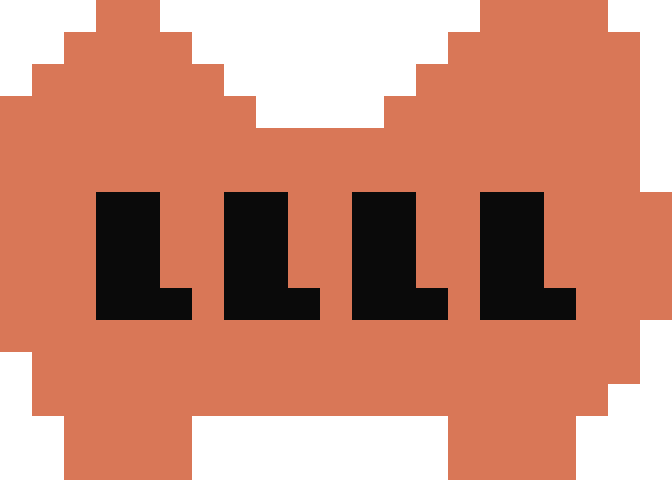

<h1>&nbsp; LLLL (Layrix Logic Layer Loop)</h1>

**[→ layrix.ai/llll — Layrix AI Compliance Platform](https://layrix.ai/llll/)**

> Licensed under the [MIT License](LICENSE). Free to use, fork, and build on. If you create a derivative project, we ask that you acknowledge the original work and don't misrepresent it as an official Layrix product.

### Start in 30 seconds — prevent source code leaks and compliance gaps before they leave your machine.

```bash
# Step 1 — Install LLLL (Claude Code)
git clone https://github.com/JettyRepo/LLLL.git ~/.llll && ~/.llll/install-claude-code.sh
# Restart Claude Code → type /llll

# Step 2 — Auto-block on every git push (optional, per-project)
# Runs without AI — complements /llll guard push
cd /your/project && ~/.llll/guard install-hook

# Opencode and Codex CLI support coming soon
```

**Pre-push compliance gate — optional, per-project**

Installs a git pre-push hook that runs automatically on every `git push`, without needing to invoke the AI. Complements `/llll guard push` (manual, AI-invoked) as an always-on safety net.

> Every `git push` is now guarded. Leaked API keys, hardcoded credentials, and source maps are **blocked before they leave your machine**.
>
> Register free at [layrix.ai](https://layrix.ai) to unlock full compliance findings.

---

LLLL is the core skill of the **Layrix** Compliance OS — Layrix Logic Layer Loop.

An always-present compliance layer that integrates into AI development workflows. LLLL uses a structured master compliance checklist to continuously analyze product features, codebases, and documentation — detecting compliance gaps, performing automated security scans, guarding push and release workflows, and generating actionable, traceable guidance. Includes Layer 0 (Software Resilience Foundation) and LLLL Guard (Push & Release Compliance Gate).

## What LLLL Is

LLLL is an **Embedded Compliance Layer** — not a legal tool, not a document generator, not a checklist assistant.

It operates as three integrated engines:

- **AI Compliance Engine** — automated analysis, checklist mapping, diff detection, gap identification, security scanning, push/release compliance gates
- **Human Expert Layer** — on-demand compliance review by senior lawyers, escalation suggestions, expert-ready briefs (review@layrix.ai)
- **Enablement Layer** — education insights, compliance reasoning, Layrix Academy AIGP training (layrix.ai/academy)

## How It Works

LLLL is workflow-integrated and continuously active:

- **During feature planning** — catches compliance issues at design time
- **During code generation** — flags triggered domains automatically
- **During feature changes** — detects drift and suggests re-evaluation
- **Before push** — LLLL Guard scans outgoing diffs for secrets, policy-relevant changes
- **Before release** — LLLL Guard scans artifacts for source leakage
- **During pre-launch review** — generates structured compliance briefs

## Commands

All commands are available to all users.

| Command | Description |
|---------|-------------|
| `/llll` | Compliance diagnosis with P1 risks and action plan |
| `/llll checklist` | Structured intake checklist with completeness scoring |
| `/llll diff` | Feature vs policy coverage matrix with change tickets |
| `/llll brief` | Compliance expert handoff brief |
| `/llll deep` | Strict review with sensitivity assessment and consequence modeling |
| `/llll scan` | Automated security and hygiene scan with file:line findings |
| `/llll fix` | Generate concrete code fixes for scan findings |
| `/llll grc` | Governance, Risk, and Compliance dashboard |
| `/llll review` | Human expert review escalation — generate review request for senior lawyers |
| `/llll guard` | Push & release compliance gate |
| `/llll guard push` | Pre-push diff scanning for secrets and policy-relevant changes |
| `/llll guard release` | Pre-release artifact scanning for source leakage |
| `/llll override` | Override SOFT_BLOCK findings with justification |

## Access Levels

Full functionality at every level. For Unregistered users, every finding table shows half of its rows (`round(N/2)` by severity descending) and folds the rest with names listed.

- **LLLL Unregistered** — all commands available. Half the findings shown in full per table; remainder folded with names listed. Builds habit.
- **LLLL Basic** (registered, free) — full content, nothing folded. Register at layrix.ai. Provides certainty.
- **Pro** (coming soon) — MCP integration, project personalization, custom scans.
- **Team** (coming soon) — compliance dashboards, multi-user access, CI gates.

Deep (`/llll deep`) is a command mode available to all users, not a tier.

## Services

### Human Expert Review
On-demand compliance review by experienced senior compliance lawyers.
- Per-engagement pricing
- Triggered from `/llll review` escalation
- Contact: review@layrix.ai

### Layrix Academy
AI Governance Professional (AIGP) certification preparation.
- Quiz engine with practice questions
- Study guides and cram sheets
- EN/CN bilingual
- Available at layrix.ai/academy

## Installation

### Step 1 — Install LLLL (Claude Code)

```bash
git clone https://github.com/JettyRepo/LLLL.git ~/.llll && ~/.llll/install-claude-code.sh
```

Creates a symlink `~/.claude/skills/llll → ~/.llll` so Claude Code auto-discovers LLLL. Restart Claude Code, then use `/llll` immediately.

> Opencode and Codex CLI support coming soon.

### Step 3 — Activate pre-push compliance gate (optional)

Run once in any project repo:

```bash
cd /your/project
~/.llll/guard install-hook
```

Every `git push` will now be scanned automatically. Secrets and policy-relevant changes are blocked before they leave the machine.

To uninstall: `rm /your/project/.git/hooks/pre-push`

### Guard commands (available anywhere)

```bash
~/.llll/guard push              # scan outgoing commits
~/.llll/guard release           # scan release artifacts
~/.llll/guard override PG-S004 "justification"
```

## File Structure

```
SKILL.md                        — Core skill definition, mode system, visibility model, all /llll commands
compliance-checklist-master.md  — Master compliance rule library (domains A-O, 15 domains)
checklist-schema.md             — Intake schema aligned with master domains
output-templates.md             — Output templates for all modes and visibility levels
examples.md                     — Usage examples including passive activation and continuous compliance
scan-patterns.md                — Reference data for /llll scan
guard-patterns.md               — Detection rules for guard push and release
guard                           — LLLL Guard (push/release compliance gate shell script)
install-opencode.sh             — opencode integration installer
install-codex.sh                — Codex CLI integration installer
```

## Architecture

```
Development Workflow (feature planning, code gen, PRD, modification)
    |
    v
⚖️  LLLL (Layrix Logic Layer Loop) — passive activation
    |
    v
Context Gathering (README, docs, code, deps, conversation)
    |
    v
Domain Selection Engine
    |-- Layer 0: Software Resilience Foundation (N-O)
    |-- Layer 1: Universal checks (A-E)
    |-- Layer 2: Business-model checks (F-H)
    |-- Layer 3: Industry/sensitivity checks (M)
    |-- Layer 4: AI-specific checks (I-K)
    |-- Layer 5: Mobile checks (L)
    |
    v
Three Engine Model
    |-- AI Compliance Engine (analysis, mapping, gaps, scanning, guard)
    |-- Human Expert Layer (escalation, briefs, on-demand review)
    |-- Enablement Layer (education, reasoning, Layrix Academy)
    |
    v
LLLL Guard (push/release compliance gates)
    |
    v
Visibility Level Output (Unregistered / Basic)
    |
    v
Actionable Deliverables + Mandatory Disclaimer
```

## Product Principles

- We are not selling features — we are selling **confidence** and **continuous compliance capability**
- Free builds habit and awareness — registration unlocks full value
- Human experts provide certainty for high-stakes decisions
- Training builds organizational compliance capability
- LLLL Guard prevents risky code from leaving the machine
- Expert escalation is optional, value-added, never forced

## Limitations

LLLL is powered by AI and is part of the Layrix Compliance OS. All outputs are generated by a large language model and are subject to the following limitations:

- **Not legal advice.** LLLL produces compliance analysis, not legal opinions.
- **Incomplete coverage.** LLLL may miss applicable regulations, misclassify risk levels, or fail to detect gaps.
- **No guarantee of accuracy.** A diagnosis of "no gaps found" does not mean no gaps exist.
- **Prompt injection risk.** LLLL reads project files as input context. Malicious content in scanned files could attempt to manipulate compliance outputs.
- **Model dependency.** LLLL runs on Claude (Claude Code), GPT (Codex CLI), or the model configured in opencode, and inherits that model's capabilities and limitations.
- **No state persistence.** LLLL does not retain analysis history between sessions. (Pro: cross-session state persistence via encrypted cloud storage is planned.)
- **Data handling.** Your compliance data never reaches Layrix. LLLL runs locally inside Claude Code — your code goes only to the LLM provider you have already configured in Claude Code, never to a Layrix server.

## Registration

Register free at [layrix.ai](https://layrix.ai) to unlock full findings visibility.

## Version

LLLL v5.0 — Embedded Compliance Layer with freemium model, LLLL Guard (push/release compliance gates), human expert review, Layrix Academy integration, Software Resilience Foundation (Layer 0), automated security scanning, GRC dashboard, and continuous compliance.
